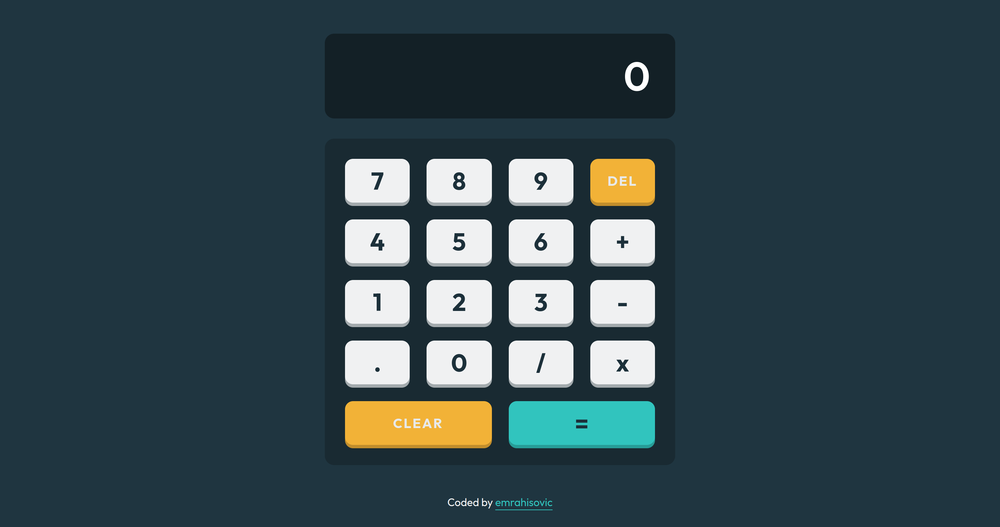

# Calculator
Final project from The Odin Project foundation course.

## Table of concepts
- [Overview](#overview)
  - [Screenshot](#screenshot)
  - [Links](#links)
- [Built with](#built-with)
- [Author](#author)

## Overview

### Screenshot

### Links
  - Live preview - [Calculator] (https://emrahiso.github.io/Calculator/)
  - GitHub repo - (https://github.com/EmrahIso/Calculator.git)

## Built with 
  - JavaScript
  - CSS Grid
  - FlexBox
  
## Author

- GitHub - [@EmrahIso](https://github.com/EmrahIso)